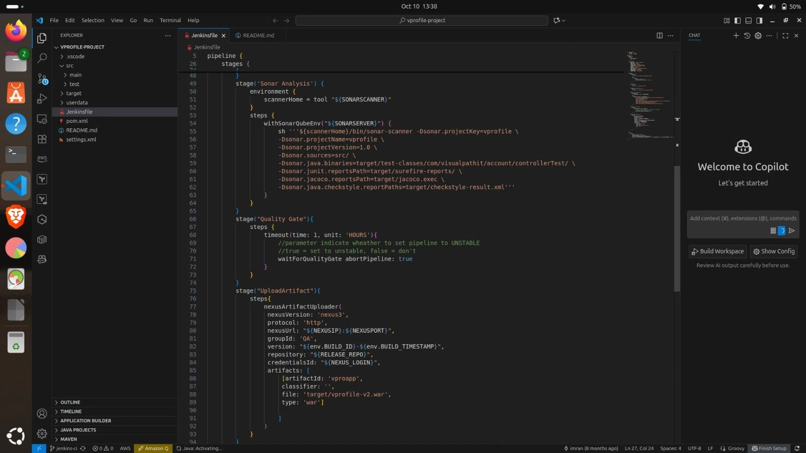
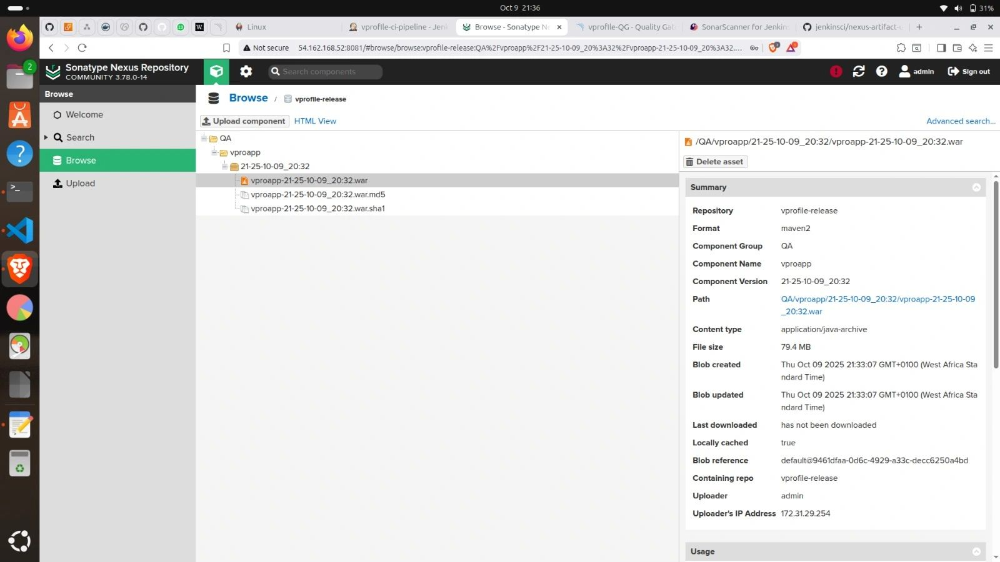
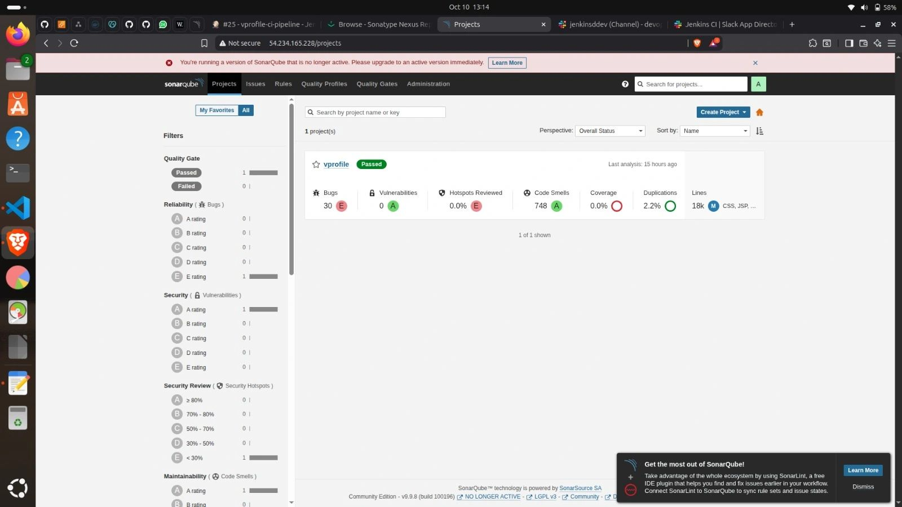
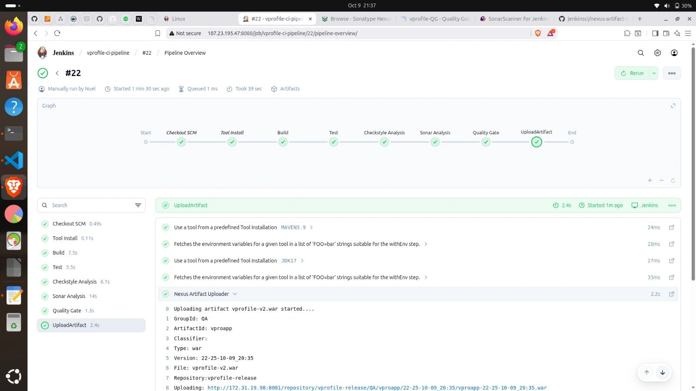
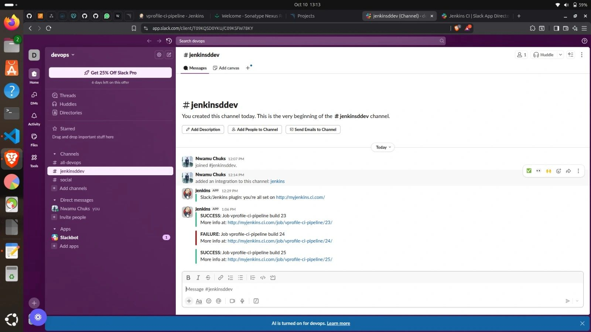

# Prerequisites 
#
- JDK 17 or 21
- Maven 3.9
- MySQL 8

# Technologies
- Spring MVC
- Spring Security
- Spring Data JPA
- Maven
- JSP
- Tomcat
- MySQL
- Memcached
- Rabbitmq
- ElasticSearch

# Database
Here,we used Mysql DB
sql dump file:
- /src/main/resources/db_backup.sql
- db_backup.sql file is a mysql dump file.we have to import this dump to mysql db server
- > mysql -u <user_name> -p accounts < db_backup.sql

# Vprofile-contineous-integration-with-jenkins-and-tools
Archictural diagram

🎯 The Goal of this project is to establish a fully automated, 'Shift Left' quality-focused pipeline that ensures every release is validated against strict quality gates, is securely versioned, and provides developers with instant feedback upon failure.

STEPS
1. Login to AWS Account
2. Create key pair
3. Create Security Group
Jenkins, Nexus & Sonarqube
    a. Create Ec2 Instances with userdata
4. Create EC2 instances with userdata
    a. Jenkins, Nexus & Sonarqube
5. Post installation
    a. Write jenkinsfile, setup jenkins & plugins
    
    
    b. Nexus setup & repository setup
    
    C. Sonarqube login test
6. Git
    a. migrated code to my github repository
    b. Integrate github repo with VsCode and test it
7. Build Job with Nexus integration

8. Github Webhook
9. Sonarqube server integration stage

10. Nexus Artifact upload stage

11. Slack Notification

​# 🔍 Detailed Workflow Breakdown
​Commit & Trigger: Developers commit code to Source Code Management (SCM), which automatically Triggers a build. \

​Initial Fetch & Build: The pipeline FETCHes the code, the build process compiles the code and sends Outcome Notifications to Slack/Teams. \

​Unit Testing: Runs automated tests to validate core functionality. \

​Code Analysis: The CODE ANALYSIS engine performs static analysis and security checks. \

​Quality Gates: Both Unit Test and Code Analysis results are fed into the QUALITY GATES. Only code that meets predefined quality metrics are allowed to proceed. \

​Packaging & Storage: ​Successful code moves to VERSION ARTIFACT/PACKAGING where the application is packaged and a unique version tag is applied.​The package is uploaded via UPLOAD ARTIFACT to the ARTIFACT REPOSITORY for secure, version-controlled storage.
​Deployment Readiness & Notification: The artifact is now ready for deployment (which is the next phase). The entire team receives a final NOTIFICATION of a successful artifact creation and availability via slack.

